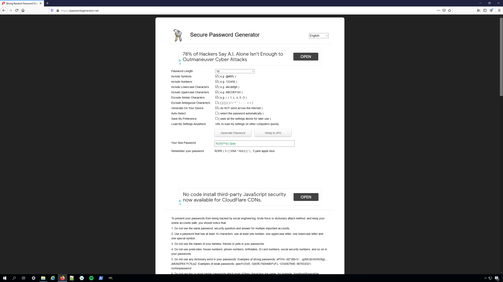

# Friendship Gone Awry - Forensics

Writeup by poortho

## Problem Description

I told my "friend" if he managed to guess my friend code, he could take anything from my luxurious island. Now, normally, I keep my friend code very secret, so I'm not worried, but recently I noticed some suspicious traffic on my computer.

Did he actually try to hack me??? I managed to grab a memory dump of this strange process along with a document on the desktop of his laptop while he was in the bathroom. Can you find out if he got my friend code? Oh no, I better put my lovely Dorado in the museum!

Author: DrDinosaur

[traffic.pcapng](./traffic.pcapng)
[notes.txt](./notes.txt)
[memory_dump](./memory_dump)

## Solution

Oh boy... this challenge was a wild ride. The challenge author, DrDinosaur, told me to make sure to solve his challenge, and I'm glad to say that I did... although not without many, many mistakes, especially later on in the challenge.

### Notes

To begin with, let's look at `notes.txt`:

```a
implant crypto

generate pub/priv keypair (box_::curve25519xsalsa20poly1305) on implant
send implant's pub key and nonce to server
generate pub/priv keypair on server
send server's pub key and nonce to implant
generate sym key/nonce on server
send sym key/nonce to client encrypted with box_
zero out priv key in pub/priv keypair in memory for security
use sym key/nonce for future messages (reuse nonce)

implant design

local struct used for debugging (not sending)
#[repr(C)] 
struct version_key_struct {
    version: String,
    key: [u8; secretbox::xsalsa20poly1305::KEYBYTES],
    nonce: [u8; secretbox::xsalsa20poly1305::NONCEBYTES],
}

version string should start with "Version: "

todo:
review messages.proto
```

This file, although short, provides us with a lot amount of information.

1. The implant performs some sort of public key crypto, but it says that the private key is zeroed out. As a result, we can likely ignore the public key crypto aspect here.
2. In contrast, the symmetric key crypto is what we're interested in. We know that the nonce is reused, and that the symmetric key is likely still in the memory dump.
3. From the given struct, we see that the implant is written in Rust. Furthermore, we see that the symmetric key crypto algorithm is `secretbox`. A quick google reveals that the key is 32 bytes and the nonce is 24 bytes.
4. We are given that the version string starts with `"Version: "`, which is in the struct. We can use this to find the symmetric key in the memory dump.
5. The notes mention `message.proto`, which likely means that the pcap likely uses protobufs to communicate.

### Memory dump

Based on the notes, we can be fairly certain that we can recover the symmetric key. To do this, we open up the memory dump in GHIDRA (as the memory dump is an ELF).

After GHIDRA finally loads the file, we go to **Search -> For Strings... -> Search** to obtain a list of strings in the memory dump. Then, we enter `Version: ` in the search bar, and find the string `Version: 0.13.37`.

More importantly, however, we notice that the version string is at the address `0x564be6144d80`. This time, we go to **Search -> Memory** and enter `564be6144d80` as our value.

There are two occurrences of the pointer here - I'm not exactly sure why, but both copies have the key and the nonce immediately after them in memory.

key: `6B4C397D6D9E3F5E20D0B33B594C57AC03E5A42CFD432B71D43F8772F3F23381`

nonce: `F228B1C1C5ED37509726BE5FF8A87D3A05258D0235013BF7`

### PCAP

By now, you're probably wondering why this challenge is hard, right? Everything seems pretty easy so far.

Well, here's where it starts.

Opening up the pcap, we're greeted with a bunch of SSL traffic. OK, great, we have the key and the nonce - we can just plug them into wireshark and have it decrypt it, right?

Well, maybe. But if you can, I don't know how. The only SSL trick I know is the secret log file, which our key and nonce clearly are not.

So, what do we do? It was at this moment that I made the mistake of trying to do the decryption by hand.

To get started, I wrote a quick python script that would decrypt a file given to it:

```python
import nacl.secret

key = '6B4C397D6D9E3F5E20D0B33B594C57AC03E5A42CFD432B71D43F8772F3F23381'.decode('hex')
nonce = 'F228B1C1C5ED37509726BE5FF8A87D3A05258D0235013BF7'.decode('hex')
data = open("cipher.txt", "rb").read()
box = nacl.secret.SecretBox(key)

f = open("decrypted", "wb")
f.write(box.decrypt(data, nonce))
f.close()
```

But what data do we actually decrypt? I took the educated guess that it was the data in the "transport layer security" section of each non-ack packet.

I tried decrypting the data this way by copy pasting the bytes directly from wireshark into the file, then running my script. This worked decently well - I recovered a string `tom.jpg` (packet 12), and an interesting image (packets 43-45):



Notably, this seems to give us a password, `R(3/[V*H}'(;5pax`, that will likely be used later.

Additionally, because we were able to decrypt something successfully, this means that our key and nonce must be correct. Otherwise, decryption would fail because secretbox is a type of authenticated encryption, meaning it has a mechanism to detect if a ciphertext has been modified or not.

If you're familiar with TLS/SSL, you might be a little confused at this point - this isn't how SSL works! And you'd be right - though I didn't notice at the time, the "SSL" traffic here isn't actually SSL traffic - Wireshark just thinks it is because it's port 443. In reality, it's the raw secretbox encrypted data being sent by the implant. In Wireshark, you can right click on a TLS packet, go to Protocol Preferences, and then select "Disable TLS" to stop Wireshark from thinking the data is TLS encrypted, which makes the packet capture easier to analyze.

Now, however, I got stuck. Any other things I attempted to decrypt would simply fail.

So, how do we proceed now? I figured that I was doing something dumb while decrypting (which, as you'll see later, I was), so I attempted to figure out how to decrypt without actually performing the authentication.

To do this, we'll have to look at how secretbox actually works. There's a hint from notes.txt - specifically `xsalsa20poly1305`. This denotes two things - XSalsa20 and Poly1305. A quick google reveals that XSalsa20 is a stream cipher, and Poly1305 is a MAC. In other words, XSalsa20 is used to actually encrypt the data, and Poly1305 is used to authenticate it. So, if we just ignore the MAC and get the stream, we should be able to decrypt without verification.

To do this, we have to figure out where the MAC is:

```python
import nacl.secret

key = '6B4C397D6D9E3F5E20D0B33B594C57AC03E5A42CFD432B71D43F8772F3F23381'.decode('hex')
nonce = 'F228B1C1C5ED37509726BE5FF8A87D3A05258D0235013BF7'.decode('hex')
box = nacl.secret.SecretBox(key)

print box.encrypt('AAAA', nonce)[24:].encode('hex')
print box.encrypt('AAAB', nonce)[24:].encode('hex')
```

This script prints out:

```a
cd1307d40b56591861d2dbe353d0ab2057511d2c
b03228998d50636022610118e211b1f857511d2f
```

Here, we notice that the last 4 bytes are very similar (as one would expect in a stream cipher), whereas the first 16 bytes are completely different - this means that the ciphertext is prepended with the MAC, so if we want to decrypt without verification, we should ignore those bytes.

Okay, now, to actually do the encryption, we can generate the keystream simply encrypting a bunch of null bytes, then XORing the resulting "ciphertext" with a given ciphertext to decrypt it:

```python
import nacl.secret

key = '6B4C397D6D9E3F5E20D0B33B594C57AC03E5A42CFD432B71D43F8772F3F23381'.decode('hex')
nonce = 'F228B1C1C5ED37509726BE5FF8A87D3A05258D0235013BF7'.decode('hex')
data = open("cipher.txt", "rb").read()
box = nacl.secret.SecretBox(key)

# Courtesy of stackoverflow
def sxor(s1,s2):
    return ''.join(chr(ord(a) ^ ord(b)) for a,b in zip(s1,s2))

# get rid of MAC
data = data[16:]

# generate the keystream
keystream = box.encrypt("\x00"*len(data), nonce)[24+16:] # get rid of MAC and nonce

f = open("decrypted", "wb")
f.write(sxor(data, keystream))
f.close()
```

With this new script, we can perform decryption of a truncated plaintext. Notably, if we decrypt the first few bytes of a ciphertext block (which I correctly assumed would only start at the beginning of the packet), we can check to see if it is a valid protobuf header, and if so, we can find the length of the entire ciphertext using [protobuf-inspector](https://github.com/mildsunrise/protobuf-inspector), which will tell us the length of the full ciphertext. You'll have to modify the source code right before the failed assertion to have it print out the length.

By doing so, we find three more interesting ciphertext blobs: one starting at packet 13, one starting at packet 97, and another starting at packet 387.

I was quite confused at this point, because I figured a ciphertext blob was at packet 13 and tried decrypting it, and even brute forced the end point.

It turns out that doing things by hand is a bad idea. When I was copy pasting bytes into my HxD (my hex editor of choice), I would have to delete the TCP header bytes to only get the TLS data. Since the TCP header typically ended in null bytes, I would use that to sort of eyeball how many bytes I should delete. But, looking at packet 21, the first byte of the encrypted data is actually a null byte, which I deleted every time I tried to do this by hand, causing the decryption to fail. Well, that sucks.

Alright, well, let's stop doing things by hand then, shall we? To exfiltrate all the encrypted traffic, we utilize a wireshark filter (something like, for example, `ip.src==10.128.0.2 && frame.number > 96 && frame.number < 387 && !tcp.analysis.out_of_order && !tcp.analysis.fast_retransmission`) to limit the filtered packets to only one ciphertext blob. Then we export these to a file using **File -> Export Packet Dissections -> As Plain Text** and unselect all the fields except "Packet Bytes". Afterwards, we do some simple text processing to delete the TCP headers and the sections that aren't part of the hex dump. Finally, we take the hex, paste it into our hex editor, and we have our ciphertext blob.

Decrypting our three blobs and parsing the protobuf, we get these (as well as the image we found earlier):

[mystery_file](./mystery_file) [audio.mp3](./audio.mp3) [new_pcap.pcapng](./new_pcap.pcapng) [secrets.log](./secrets.log)

### Mystery file

Okay - there's a lot of new evidence here. Let's start with the mystery file.

Looking at the mystery file in a hex editor, it doesn't seem to be any particular file type. Indeed, running `file` on it simply yields `data` as the result. Similarly, running `binwalk` and `foremost` both yield nothing of interest.

There's probably something else in the evidence that tells us how to use this. Let's move on.

### Audio

Looking at the mp3 file, there doesn't appear to be anything interesting except the audio itself.

The audio is a person speaking, presumably the victim in this case. Here's a transcript of what he says :

```a
Hmm... what should I set my password to?
Probably want a secure password.
Maybe... (googling) "secure password generator"?
This looks pretty good. Length of 16... okay. Generated it.
Um... oh, I should use the wordlist I have for extra security.
Oh yeah, I can uh, have the red one.
That's the uh, that's the next one I was going to use.
So maybe I can append the red word to the password I randomly generated.
I think that should be pretty strong.
```

Okay - this is pretty interesting. He mentions a randomly generated password - it's likely that this is the same password that is shown in the PNG we recovered way in the beginning - `R(3/[V*H}'(;5pax`! Next, he mentions a wordlist, and in particular picks the "red one". We don't know what this word list is, but it's likely that it will come up later.

### New pcap

Opening it up, we're greeted with a ton of SSL traffic - real SSL traffic this time. Fortunately, if we look at secrets.log, we see stuff like:

```a
# SSL/TLS secrets log file, generated by NSS

CLIENT_RANDOM 8ea2253d0e7d503c6fa8d1db5ba3f5a47900291595ed0cf9eecaff21806ee823 644a24400fd559e49eaf4958c93b2ba73c84feb44c0077e5ab90797b5be088b2bd25586ab79c83c1ad6e623fb66a7449

... and more
```

This is a secrets log file, meaning we can use it to decrypt the SSL traffic! In Wireshark, we go to **Edit -> Preferences -> Protocols -> TLS (or SSL depending on your wireshark version) -> (Pre)-Master-Secret log filename** and select secrets.log. Just like that, our SSL traffic is decrypted!

First, let's look through the HTTP files through **File -> Export Objects -> HTTP**. Here, we see a lot of host names - some websites for SSL stuff, and some other weird domains such as `tharbadir.com` and `nativepu.sh`. Out of all of these, however, one site in particular pops out: `anotepad.com`.

We see that the victim creates a note at `https://anotepad.com/notes/54dsnxwy`. Unfortunately, when we try to visit it, it looks like it's been deleted. I spent some time trying to figure out what to do.

Of course, it turns out I was overthinking things, because the pcap itself has a GET request for the note! We then extract the file, yielding [wordlist.html](./wordlist.html).

Opening up the html file, we see that it's the wordlist we want! There's even the red word - `annoyed`. With this, we have the complete password: `R(3/[V*H}'(;5paxannoyed`.

### The mystery file, revisited

We've found at least one useful thing from every piece of evidence so far - except this mystery file.

I figured that we had to use the password somehow to decrypt the file. I tried simple things such as performing a simple xor, but without success. I considered something like Veracrypt or an encrypted LUKS partition, but since the mystery file didn't have a file header, I eliminated that as a possibility.

I got stuck here for a while, until DrDinosaur (the challenge author) thankfully released a hint - "For Friendship Gone Awry, if you are stuck toward the end on what to do, look closely at what you have decrypted."

This definitely sounds like a hint for what we're stuck on now. Struck with a flash of inspiration, I looked back at the original image I found:


Looking at the task bar, we see the Veracrypt icon at the bottom! This means our mystery blob is encrypted with Veracrypt.

But wait, didn't I say that Veracrypt files have headers? Well, that's what I thought, but as is often the case, I was wrong.

Just to make sure, I looked up how to detect encrypted Veracrypt volumes, and found [this](https://www.raedts.biz/forensics/detecting-truecrypt-veracrypt-volumes/). Sure enough, our mystery blob passes all of the checks mentioned in the article.

Okay - we're at the final stretch. We just need to decrypt the Veracrypt volume with our password, right?

Usually, whenever a question is asked like this, the answer is usually "it's not that simple".

I copied the password into Veracrypt and attempted to decrypt. I eagerly waited for the volume to decrypt and finish the challenge.

Well, you can probably see where I'm going with this. It didn't work.

So, here's an interesting story. Throughout this challenge, I've been using python for a lot of stuff - such as computing where each encrypted blob in the original pcap starts/ends, or testing out the string xor between the password and encrypted blob I mentioned earlier.

So, I copy pasted the password from my python IDLE into Veracrypt when I tried to decrypt the volume. And you see the single quote in `R(3/[V*H}'(;5paxannoyed`? Well, it turns out I had put a backslash there in python to escape the single quote, and that backslash was still there when I copy pasted it...

Finally, I typed in the actual password into Veracrypt, and got the flag.

## Flag

`uiuctf{time_to_start_farming_bells_again}`
